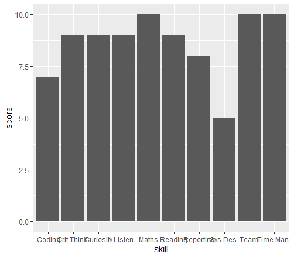

--- 
title: "Curriculum Vitae"
author: "Kenneth I. Dagogo"
date: "09/01/2020"
output: pdf_document
editor_options: 
  chunk_output_type: console
---
  
## Overview of my data science profile
  
<<<<<<< HEAD
  I am a data enthusiast, who loves data and is able to understand the language that data speaks. I have a good technical background. 
=======
  I am a data enthusiast, who loves data and is able to understand the language that data speaks. I have a good technical background and I am currently going through a Data Science Program at the Stutern SGA 0.7, Data Science track.. 
>>>>>>> 29884ea8c14a05cad8b549f53b10db74d1d6ebe6
  Please, find attached below, a barchart which gives a brief description of my data science skills.
  

```{r echo=FALSE}
skill <- c("Reading", "Crit.Think.", "Time Man.", "Maths", " Coding", "Sys.Des.", "Reporting", "Listen", "Team", "Curiosity")
score <- c(9, 9, 10, 10, 7, 5, 8, 9, 10, 9)

data_science_profile <- data.frame(skill, score)

library(ggplot2)

ggplot(data=data_science_profile, aes(x=skill, y=score))  + 
  geom_bar(stat="identity")
```
<<<<<<< HEAD


=======
>>>>>>> 29884ea8c14a05cad8b549f53b10db74d1d6ebe6
